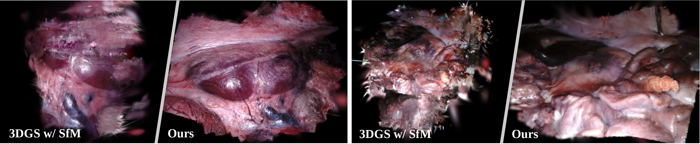
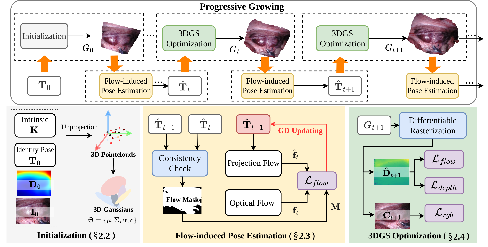
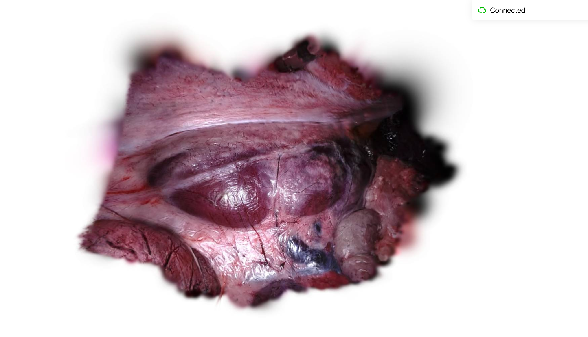

<p align="center">
  <h2 align="center">Free-SurGS: SfM-Free 3D Gaussian Splatting for Surgical Scene Reconstruction</h2>
  <p align="center">
    <a href="https://wrld.github.io/"><strong>Jiaxin Guo</strong></a><sup>1</sup>&nbsp;&nbsp;&nbsp;
    <a href="https://laura-wang.github.io/"><strong>Jiangliu Wang</strong></a><sup>1</sup>&nbsp;&nbsp;&nbsp;
    <a href="https://scholar.google.com.hk/citations?user=2ztThPwAAAAJ&hl=zh-CN"><strong>Di Kang</strong></a><sup>2</sup>&nbsp;&nbsp;&nbsp;
    <strong>Wenzhen Dong</strong></a><sup>1</sup>&nbsp;&nbsp;&nbsp;
    <strong>Wenting Wang</strong><sup>1</sup>&nbsp;&nbsp;&nbsp;
    <a href="https://www4.mae.cuhk.edu.hk/peoples/liu-yun-hui/"><strong>Yun-hui Liu</strong></a><sup>1, 3</sup>&nbsp;&nbsp;&nbsp;
    <br />
    <sup>1</sup><strong>CUHK</strong>&nbsp;&nbsp;&nbsp; <sup>2</sup><strong>Tencent AI Lab</strong>&nbsp;&nbsp;&nbsp; <sup>3</sup><strong>HKCLR</strong>&nbsp;&nbsp;&nbsp; 
  </p>
</p>

The repository contains the official implementation for the MICCAI 2024 paper [Free-SurGS: SfM-Free 3D Gaussian Splatting for Surgical Scene Reconstruction](https://arxiv.org/abs/2407.02918). 



3DGS with SfM fails to recover accurate camera poses and geometry in surgical scenes due to the challenges of minimal textures and photometric inconsistencies. In our paper, we propose Free-SurGS as the first SfM-free 3DGS-based method for surgical scene reconstruction from monocular video by jointly optimizing the camera poses and scene representation.

https://private-user-images.githubusercontent.com/34129157/374427960-a6a0b96a-6ecc-40c8-80e7-b0a16745f6f6.mp4?jwt=eyJhbGciOiJIUzI1NiIsInR5cCI6IkpXVCJ9.eyJpc3MiOiJnaXRodWIuY29tIiwiYXVkIjoicmF3LmdpdGh1YnVzZXJjb250ZW50LmNvbSIsImtleSI6ImtleTUiLCJleHAiOjE3MjgzNjc5NzUsIm5iZiI6MTcyODM2NzY3NSwicGF0aCI6Ii8zNDEyOTE1Ny8zNzQ0Mjc5NjAtYTZhMGI5NmEtNmVjYy00MGM4LTgwZTctYjBhMTY3NDVmNmY2Lm1wND9YLUFtei1BbGdvcml0aG09QVdTNC1ITUFDLVNIQTI1NiZYLUFtei1DcmVkZW50aWFsPUFLSUFWQ09EWUxTQTUzUFFLNFpBJTJGMjAyNDEwMDglMkZ1cy1lYXN0LTElMkZzMyUyRmF3czRfcmVxdWVzdCZYLUFtei1EYXRlPTIwMjQxMDA4VDA2MDc1NVomWC1BbXotRXhwaXJlcz0zMDAmWC1BbXotU2lnbmF0dXJlPWNiY2RmODA2NWNlMjYwMTA3ZjFmOTcxZjhiMDMzMmRhNzMzYzkzZmY5OWM2YjczY2VkMzhkNTljNzQ2NTFkMmQmWC1BbXotU2lnbmVkSGVhZGVycz1ob3N0In0.z9lLGUsyA_w_F-EuF-pbVrI-pwLIhWFjVLY696RX-lM

## Pipeline



## Update
- Release the training and evaluation code.
- Release the web-based gaussian visualizer for pose free 3DGS.

## Installation
Our code is tested on Ubuntu22.04 + CUDA 12.1 + Pytorch 2.2.1
``` bash
conda create -n freesurgs python=3.10
conda activate freesurgs
pip install -r requirements.txt
```

## Dataset
We evaluate our method on the [SCARED dataset](https://endovissub2019-scared.grand-challenge.org/Home/). To obtain the dataset and code, please sign the challenge rules and email them to `max.allan@intusurg.com`.

To reproduce our result quickly, we provide a sequence of preprocessed demo example, please download [here](https://drive.google.com/file/d/1AdiwZRlPiBh-wOAC-flYx2YxGfASXUkI/view?usp=sharing).

## Train
To train the Free-SurGS, please follow:
``` python
python train.py -s ./data/scared_demo/ \
        --model_path ./outputs/scared_demo/ \
        --visualize True \
        --port 8039 \
        --log True
```
After training, the checkpoints and rendered test views can be found in `./outputs/`.

## Evaluation
To validate our method, please follow:
``` python
python train.py -s ./data/scared_demo/ \
        --model_path ./outputs/scared_demo/ \
        --test True \
        --start_checkpoint <path_to_the_checkpoints>
```
## Interactive Web-based Visualizer
We use the visualizer adapted from [shape-of-motion](https://shape-of-motion.github.io/) based on Viser and nerfview. You can easily visualize reconstructed 3D gaussian via connecting to `http://localhost:<your_port>`.


## Acknowledgement
Our code is based on [3D Gaussian Splatting](https://github.com/graphdeco-inria/gaussian-splatting) and has incorporated some parts from [SplaTAM](https://github.com/spla-tam/SplaTAM). Thanks for their excellent work!

## Citing
If you find our work helpful, please cite:
```
@article{guo2024free,
  title={Free-SurGS: SfM-Free 3D Gaussian Splatting for Surgical Scene Reconstruction},
  author={Guo, Jiaxin and Wang, Jiangliu and Kang, Di and Dong, Wenzhen and Wang, Wenting and Liu, Yun-hui},
  booktitle={MICCAI},
  year={2024},
  organization={Springer}
}
```