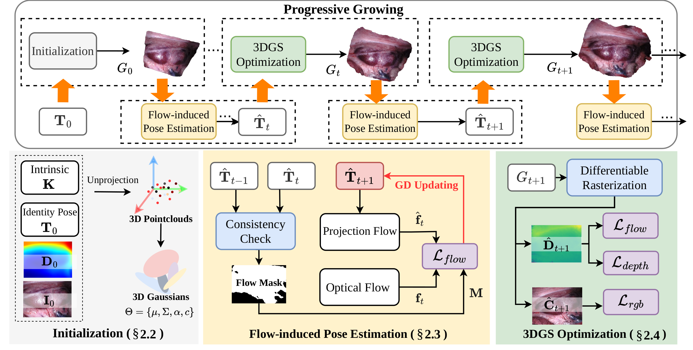

  <h2 align="center">Free-SurGS: SfM-Free 3D Gaussian Splatting for Surgical Scene Reconstruction</h2>
  

    <a href="https://wrld.github.io/"><strong>Jiaxin Guo</strong></a>1&nbsp;&nbsp;&nbsp;
    <a href="https://laura-wang.github.io/"><strong>Jiangliu Wang</strong></a>1&nbsp;&nbsp;&nbsp;
    <a href="https://scholar.google.com.hk/citations?user=2ztThPwAAAAJ&hl=zh-CN"><strong>Di Kang</strong></a>2&nbsp;&nbsp;&nbsp;
    <strong>Wenzhen Dong</strong></a>1&nbsp;&nbsp;&nbsp;
    <strong>Wenting Wang</strong>1&nbsp;&nbsp;&nbsp;
    <a href="https://www4.mae.cuhk.edu.hk/peoples/liu-yun-hui/"><strong>Yun-hui Liu</strong></a>1, 3&nbsp;&nbsp;&nbsp;
     
    1<strong>CUHK</strong>&nbsp;&nbsp;&nbsp; 2<strong>Tencent AI Lab</strong>&nbsp;&nbsp;&nbsp; 3<strong>HKCLR</strong>&nbsp;&nbsp;&nbsp; 
  

The repository contains the official implementation for the MICCAI 2024 paper [Free-SurGS: SfM-Free 3D Gaussian Splatting for Surgical Scene Reconstruction](https://arxiv.org/abs/2407.02918). 

3DGS with SfM fails to recover accurate camera poses and geometry in surgical scenes due to the challenges of minimal textures and photometric inconsistencies. In our paper, we propose Free-SurGS as the first SfM-free 3DGS-based method for surgical scene reconstruction from monocular video by jointly optimizing the camera poses and scene representation.
## Demo

<video width="720" height="400" controls autoplay muted>
  <source src="./images/video.mp4" type="video/mp4">
</video>

## Pipeline

## Update
- Code: coming soon.